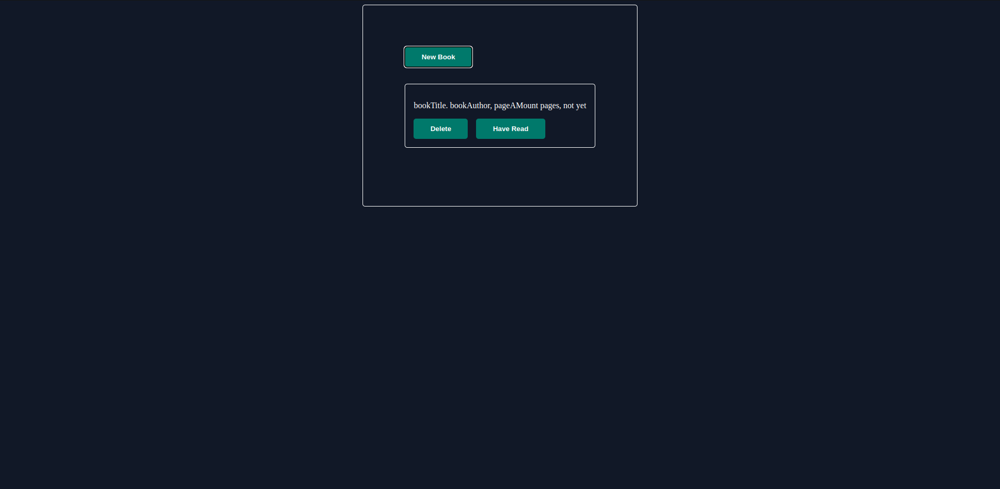

# odin-library

# Link

- [Live-preview](https://azanra.github.io/odin-library/)
- [Assignment-page](https://www.theodinproject.com/lessons/node-path-javascript-library)

# About

This project focus on using protoype property on an object constructor
to create a method by referencing prototype object. So that every instance of that constructor can use the method from the prototype of construct,The instance should inheriting the prototype from the constructor. Javascript will start looking for the method from the bottom to up. starting from the object instance itself, then constructor,
and finally protoype of the constructor. The user can input a book from the modal, update the read status, or delete it altogether.

# Review

This assignment is not really that hard, because i have done similiar project. for the javascript course i feel like there is a much more project. every reading there is immediate project for practice. not like
previous section where it will take a long time before each project. that's why i use half of my studies time to practice by creating something. but because of javascript section have a lot more project, i suddenly have multiple project that i need to work on (including project
for react practice study session). i wonder if i split my focus on so many thing.

# Screenshot

